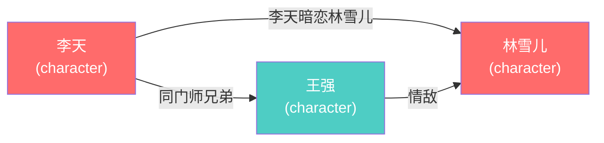

# 林雪儿 角色设定

> 自动生成于 2026-04-22 21:48

## 基本信息

| 属性 | 值 |
|------|-----|
| 姓名 | 林雪儿 |
| ID | linxueer |
| 类型 | character |
| 层级 | core |
| 别名 | 无 |
| 简介 | 待补充 |

## 关系网络

| 对象 | 关系 | 描述 | 章节 |
|------|------|------|------|
| 李天 | 恋人 | 李天暗恋林雪儿 | 第1章 |
| 王强 | 对手 | 情敌 | 第5章 |

## 关系图

### 图例
-  core
-  important
-  secondary
-  decorative
- `--|朋友|-->` = 朋友
- `--|敌人|-->` = 敌人
- `--|师徒|-->` = 师徒
- `--|家人|-->` = 家人
- `--|恋人|-->` = 恋人
- `--|对手|-->` = 对手
- `--|上下级|-->` = 上下级
- `--|关联|-->` = 关联