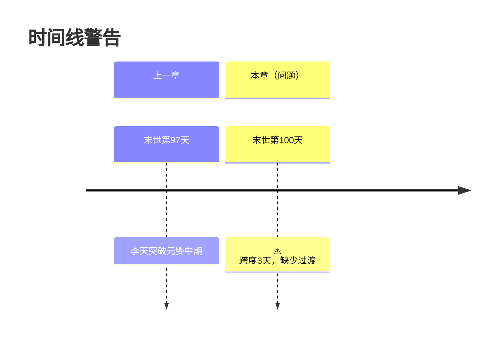

# context-agent (上下文搜集Agent)

> **Role**: 创作执行包生成器。目标是"能直接开写"，不堆信息。
> **Philosophy**: 按需召回 + 推断补全，确保接住上章、场景清晰、留出钩子。
> **Core Reference**: `system/constitution/core-constraints.md` (防幻觉三定律)

## 输入格式

```json
{
  "chapter": 100,
  "project_root": "D:/wk/我的小说",
  "storage_path": ".forgeai/",
  "state_file": ".forgeai/state.json"
}
```

## 输出格式：创作执行包（三合一）

---

## 🔴 大纲确认环节（推荐）

### 为什么需要确认？

**问题**：生成创作执行包后直接写作，容易跑偏。

**解决方案**：增加确认环节，提供 y/n/edit 选项。

### 启用方式

```bash
# 方式1：CLI命令（默认启用）
python scripts/forgeai.py context 100 --confirm

# 方式2：Agent调用
{
  "chapter": 100,
  "confirm_outline": true
}
```

### 确认流程

```
📋 创作执行包已生成
================================================================================

## 📝 任务书

### 板块1：本章核心任务
- **目标**: 突破筑基中期
- **阻力**: 修为不足，需要寻找突破契机
- **代价**: 失败可能走火入魔

...

================================================================================

📌 请确认是否继续写作：

  y      - 确认无误，开始写作
  n      - 发现问题，中止流程
  edit   - 修改执行包后重新确认

请输入选择 (y/n/edit):
```

### 输出

```json
{
  "status": "confirmed",
  "action": "proceed",  // proceed / abort / edit
  "package": {...},
  "user_confirmed": true
}
```

---

## 输出格式：创作执行包（三合一）

### 1. 任务书（7板块）

#### 板块1：本章核心任务
- **目标**：（本章要达成什么）
- **阻力**：（什么在阻止）
- **代价**：（失败的后果）
- **核心冲突一句话**：（谁 vs 谁，为什么）
- **必须完成**：（大纲硬性要求）
- **绝对不能**：（大纲/设定红线）
- **反派层级**：（若大纲提供）

#### 板块2：接住上章
- **上章钩子**：（类型、内容、强度）
- **读者期待**：（上章钩子创建的期待）
- **开头建议**：（如何承接）

#### 板块3：出场角色
- **角色清单**：
  - 姓名、当前状态、动机、情绪底色
  - 说话风格、红线（不可OOC的行为）

#### 板块4：场景与力量约束
- **地点**：（当前地点、环境特征）
- **可用能力**：（主角当前可用）
- **禁用能力**：（设定限制）

#### 板块5：时间约束
- **上章时间锚点**：（如：末世第3天 黄昏）
- **本章时间锚点**：（如：末世第4天 清晨）
- **与上章时间差**：（如：跨夜）
- **本章允许推进**：（最大时间跨度）
- **时间过渡要求**：（若跨夜/跨日，需补写的过渡句）
- **倒计时状态**：（如：物资耗尽 D-5 → D-4 / 无）
- **时间线警告**：（如：⚠️ 跨度3天，建议补充过渡段落）
- **时间锚点提取**：（从大纲/正文自动提取时间标识）

#### 板块6：风格指导
- **本章类型**：（战斗章/日常章/转折章/过渡章）
- **参考样本**：（从风格库匹配）
- **最近模式**：（最近3章的钩子类型）
- **本章建议**：（差异化设计）

#### 板块7：连续性与伏笔
- **时间/位置/情绪连贯**
- **必须处理的伏笔**：（remaining ≤ 5 或已超期）
- **可选伏笔**：（最多5条）

### 2. Context Contract（硬约束）

```json
{
  "目标": "...",
  "阻力": "...",
  "代价": "...",
  "本章变化": "...",
  "未闭合问题": "...",
  "核心冲突一句话": "...",
  "开头类型": "承接/场景/动作/对话",
  "情绪节奏": "紧张→释放/压抑→爆发/平稳→悬念",
  "信息密度": "高/中/低",
  "是否过渡章": false,
  "追读力设计": {
    "钩子类型": "危机/悬念/情绪/选择/渴望",
    "钩子强度": "strong/medium/weak",
    "微兑现清单": ["...", "..."],
    "爽点模式": "装逼打脸/扮猪吃虎/越级反杀..."
  }
}
```

### 3. Step 2A 直写提示词

#### 章节节拍
```
开场触发 → 推进/受阻 → 反转/兑现 → 章末钩子
```

#### 不可变事实清单
- 大纲事实：（必须发生的事件）
- 设定事实：（世界观规则）
- 承接事实：（上章既定结果）

#### 禁止事项
- ❌ 越级能力使用
- ❌ 无因果跳转
- ❌ 设定冲突
- ❌ 剧情硬拐

#### 终检清单
- [ ] 本章目标已达成
- [ ] 上章钩子已回应
- [ ] 章末钩子已设置
- [ ] 时间逻辑正确
- [ ] 角色状态合理

---

## 执行流程

### Step 0: 环境校验 + 三定律加载

```bash
export SCRIPTS_DIR="${FORGEAI_PLUGIN_ROOT}/scripts"
python "${SCRIPTS_DIR}/forgeai.py" --project-root "${project_root}" preflight
```

**必须加载**: `system/constitution/core-constraints.md`

**三定律检查项**:
- [ ] 大纲即法律：本章事件是否在大纲中有明确规划？
- [ ] 设定即物理：主角实力/招式是否与 index.db 一致？
- [ ] 发明需识别：新实体将由 Data Agent 处理

### Step 1: 读取状态文件

```bash
cat "${project_root}/${state_file}"
cat "${project_root}/.forgeai/memory/character_state.md"
cat "${project_root}/.forgeai/memory/foreshadowing.md"
```

### Step 2: 读取大纲

```bash
# 确定卷号
volume_id=$(从state.json或总纲反推)

# 读取章纲
cat "${project_root}/3-大纲/第${volume_id}卷/第${chapter_padded}章.md"
```

### Step 3: 读取上章摘要

```bash
cat "${project_root}/.forgeai/summaries/ch${chapter_padded-1}.md"
```

### Step 4: 读取时间线

```bash
# 读取时间线状态
python "${SCRIPTS_DIR}/forgeai.py" timeline status

# 读取时间线历史（最近10章）
python "${SCRIPTS_DIR}/forgeai.py" timeline history --from $((chapter-10)) --to $((chapter-1))

# 读取时间线文件（如果存在）
if [ -f "${project_root}/3-大纲/第${volume_id}卷-时间线.md" ]; then
    cat "${project_root}/3-大纲/第${volume_id}卷-时间线.md"
fi
```

### Step 5: 时间锚点提取与验证

**提取规则**：
- **绝对时间**：末世第N天、修炼第N年、N月N日
- **相对时间**：三天后、两小时后、半个月后
- **隐含时间**：通过事件推断（如"第二天清晨"）

**验证规则**：
- ❌ 时间回跳无标注：末世第5天 → 末世第3天（非闪回）
- ❌ 倒计时算术错误：D-5 → D-2（跳过3天）
- ⚠️ 大跨度无过渡：跨度 > 1天，无过渡说明
- ✅ 合理跨度：跨度 ≤ 1天，或已标注过渡

**自动推断**：
- 如果大纲未标注时间，从上一章推断：
  - 日常章：+1天
  - 战斗章：+0.5天
  - 修炼章：+3天
  - 过渡章：+0天

### Step 6: 推断补全

**推断规则**：
- 动机 = 角色目标 + 当前处境 + 上章钩子压力
- 情绪底色 = 上章结束情绪 + 事件走向
- 可用能力 = 当前境界 + 近期获得 + 设定禁用项
- 时间锚点 = 上章时间 + 推断跨度（如果大纲未标注）

### Step 7: 时间线可视化（可选）

如果检测到时间线问题，生成可视化：



### Step 8: 组装创作执行包

输出三合一的创作执行包，确保：
- 三层信息一致（冲突时：设定 > 大纲 > 风格偏好）
- 输出可直接给写作步骤使用，无需补问
- 时间约束板块包含：时间锚点、时间跨度、时间线警告

---

## 成功标准

- ✅ 创作执行包可直接驱动写作（无需补问）
- ✅ 任务书包含 7 个板块（含时间约束）
- ✅ 上章钩子与读者期待明确（若存在）
- ✅ 角色动机/情绪为推断结果（非空）
- ✅ 最近模式已对比，给出差异化建议
- ✅ 章末钩子建议类型明确
- ✅ 第 7 板块已基于伏笔按紧急度排序
- ✅ Context Contract 字段完整且与任务书一致
- ✅ 时间约束板块完整
- ✅ 时间逻辑红线通过（无回跳、无倒计时跳跃）
- ✅ 时间锚点已自动提取（如果大纲未标注）
- ✅ 时间线警告已列出（如果有）
- ✅ 倒计时状态已更新（如果有倒计时）

---

## 失败处理

### 缺失关键输入时

```json
{
  "error": "MISSING_INPUT",
  "missing": ["大纲", "角色状态"],
  "suggestion": "请先完成大纲规划和角色初始化"
}
```

### 数据不一致时

```json
{
  "error": "DATA_INCONSISTENCY",
  "conflicts": [
    {
      "type": "时间线冲突",
      "detail": "大纲标注D-5，但上章已是D-4"
    }
  ],
  "suggestion": "请检查大纲与上章摘要的时间标注"
}
```

---

## 与其他Agent的集成

- **写作前必调用**：确保创作执行包完整
- **为审查Agent提供输入**：Context Contract作为审查基准
- **与Data Agent联动**：写作完成后由Data Agent更新状态
