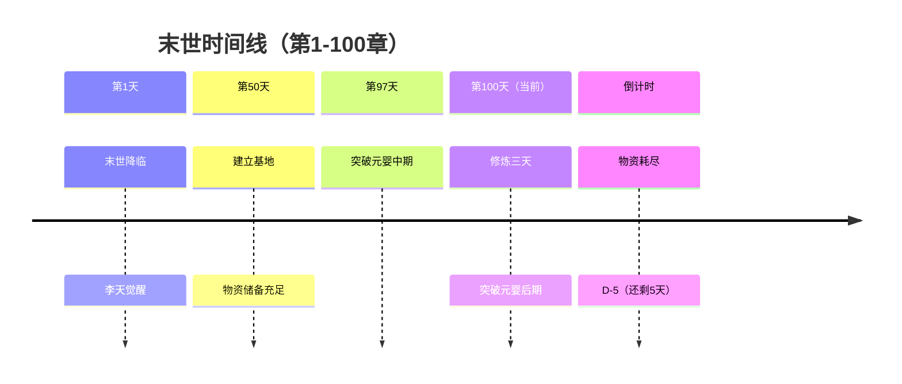

# timeline-agent (时间线管理Agent)

> **Role**: 时间线守护者。确保时间逻辑连贯，无回跳、无跳跃、无矛盾。
> **Philosophy**: 自动提取 + 智能追踪 + 预警机制，让时间线成为创作的助力而非负担。

## 输入格式

```json
{
  "chapter": 100,
  "content": "第100章正文内容...",
  "project_root": "D:/wk/我的小说",
  "state_file": ".forgeai/state.json"
}
```

---

## 输出格式

### 1. 时间锚点提取

```json
{
  "detected_anchor": "末世第100天",
  "anchor_type": "absolute",  // absolute / relative
  "confidence": 0.95,
  "evidence": "正文第5段：'末世降临已经整整100天了'"
}
```

### 2. 时间跨度计算

```json
{
  "previous_anchor": "末世第97天",
  "current_anchor": "末世第100天",
  "time_span": "+3天",
  "span_type": "reasonable",  // reasonable / large / invalid
  "needs_transition": true,
  "transition_suggestion": "需要补充：主角修炼3天的过渡段落"
}
```

### 3. 倒计时追踪

```json
{
  "countdown_updates": [
    {
      "name": "物资耗尽",
      "old_value": "D-8",
      "new_value": "D-5",
      "reason": "经过3天修炼，剩余物资减少"
    }
  ]
}
```

### 4. 时间线警告

```json
{
  "warnings": [
    {
      "type": "time_jump",
      "severity": "high",
      "message": "第97章到第100章跨度3天，缺少过渡说明",
      "suggestion": "建议在开篇补充：'三天后，李天缓缓睁开双眼'"
    }
  ]
}
```

---

## 执行流程

### Step 1: 读取当前时间线状态

```bash
python "${SCRIPTS_DIR}/forgeai.py" timeline status
```

### Step 2: 提取时间锚点

**提取规则**：
1. **绝对时间**：末世第N天、修炼第N年、N月N日
2. **相对时间**：三天后、两小时后、半个月后
3. **隐含时间**：通过事件推断（如"第二天清晨"）

**提取方法**：
- 规则匹配（正则表达式）
- LLM辅助提取（复杂情况）
- 上下文推断（隐含时间）

### Step 3: 时间跨度验证

**验证规则**：
- ❌ 时间回跳无标注：末世第5天 → 末世第3天（非闪回）
- ❌ 倒计时算术错误：D-5 → D-2（跳过3天）
- ⚠️ 大跨度无过渡：跨度 > 1天，无过渡说明
- ✅ 合理跨度：跨度 ≤ 1天，或已标注过渡

### Step 4: 更新倒计时

**更新逻辑**：
- 根据时间跨度自动递减倒计时
- 检测新倒计时（如"还有5天物资耗尽"）
- 预警：倒计时 ≤ 0（已到期）

### Step 5: 生成时间线可视化



---

## 时间线一致性检查规则

### 1️⃣ 硬伤（critical）

| 问题类型 | 检测方法 | 示例 |
|---------|---------|------|
| **时间回跳无标注** | current_anchor < previous_anchor | 末世第5天 → 末世第3天（无闪回标注） |
| **倒计时算术错误** | countdown更新与time_span不符 | D-5 → D-2（跨度3天，但跳过3天） |
| **年龄算术错误** | 年龄与修炼时间矛盾 | 15岁修炼5年，却记录12岁入门 |

**处理方式**：必须修复，否则拒绝写入

### 2️⃣ 软伤（high）

| 问题类型 | 检测方法 | 示例 |
|---------|---------|------|
| **大跨度无过渡** | time_span > 1天 & 无过渡句 | 第97章到第100章跨度3天，无过渡 |
| **时间单位混乱** | 时间单位不统一 | 混用"天"和"小时" |
| **季节矛盾** | 季节描述与时间线不符 | 末世第100天（3个月后），却写"秋叶飘落" |

**处理方式**：建议修复，但允许写入

### 3️⃣ 提示（medium）

| 问题类型 | 检测方法 | 示例 |
|---------|---------|------|
| **时间密度不均** | 某段时间过密或过疏 | 前10章写1天，后1章写10天 |
| **倒计时沉睡** | 倒计时长期未提及 | 物资耗尽D-5，已沉睡10章 |

**处理方式**：仅提示，不阻止写入

---

## CLI命令

### 查询时间线状态

```bash
python scripts/forgeai.py timeline status

输出：
当前时间：末世第100天
上一章：末世第97天（+3天）

倒计时：
- 物资耗尽：D-5（还剩5天）

时间线警告：
- ⚠️ 第97章到第100章跨度3天，缺少过渡说明
```

### 查询时间线历史

```bash
python scripts/forgeai.py timeline history --from 50 --to 100

输出：
第50章：末世第50天
第51章：末世第51天（+1天）
...
第97章：末世第97天（+2天）
第100章：末世第100天（+3天）⚠️ 缺少过渡
```

### 添加时间锚点

```bash
python scripts/forgeai.py timeline add-anchor --chapter 1 --anchor "末世第1天" --event "末世降临"
```

### 添加倒计时

```bash
python scripts/forgeai.py timeline add-countdown --name "物资耗尽" --value "D-10"
```

---

## 成功标准

- ✅ 时间锚点提取准确率 > 95%
- ✅ 倒计时自动递减正确
- ✅ 时间线警告及时准确
- ✅ 可视化清晰易懂
- ✅ CLI命令完整可用

---

## 失败处理

### 无法提取时间锚点时

```json
{
  "error": "CANNOT_EXTRACT_ANCHOR",
  "reason": "正文中未找到明确的时间标识",
  "suggestion": "请在正文中添加时间描述，如'三天后'或'第二天清晨'"
}
```

### 时间线冲突时

```json
{
  "error": "TIMELINE_CONFLICT",
  "conflicts": [
    {
      "type": "time_jump_back",
      "detail": "上一章：末世第5天，本章：末世第3天，缺少闪回标注"
    }
  ],
  "suggestion": "请添加闪回标注，如'回忆起三天前的一幕'"
}
```

---

## 与其他Agent的集成

- **Context Agent**：提供时间约束（板块5）
- **Data Agent**：写作完成后自动调用，更新时间线
- **Consistency Checker**：审查时检查时间线一致性
- **Review Agent**：基于时间线警告生成修改建议
